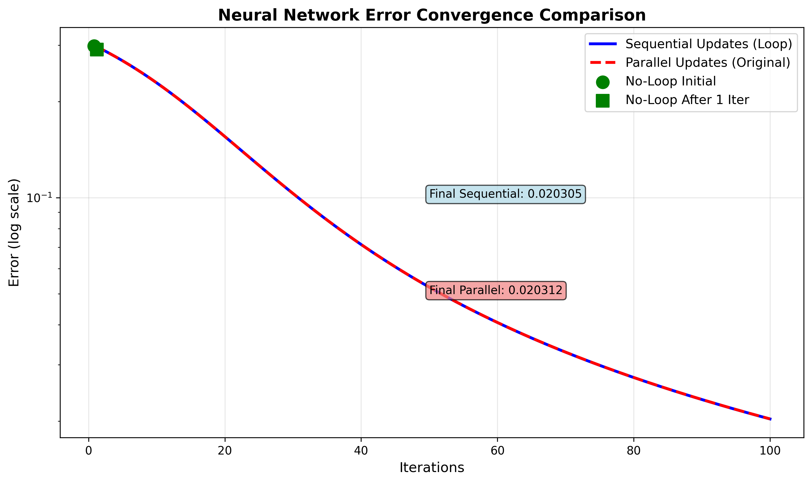
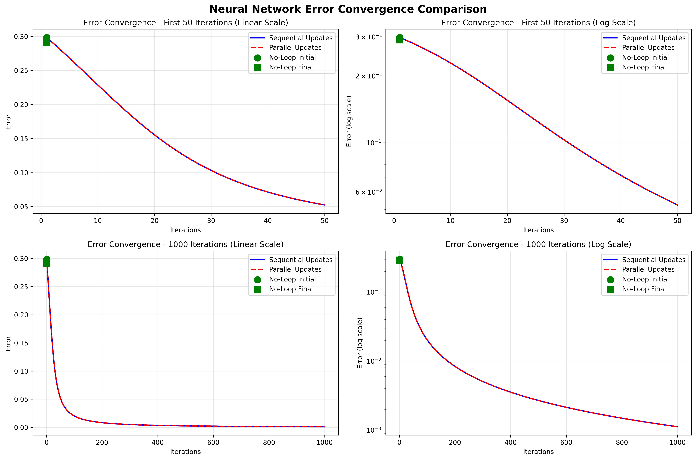
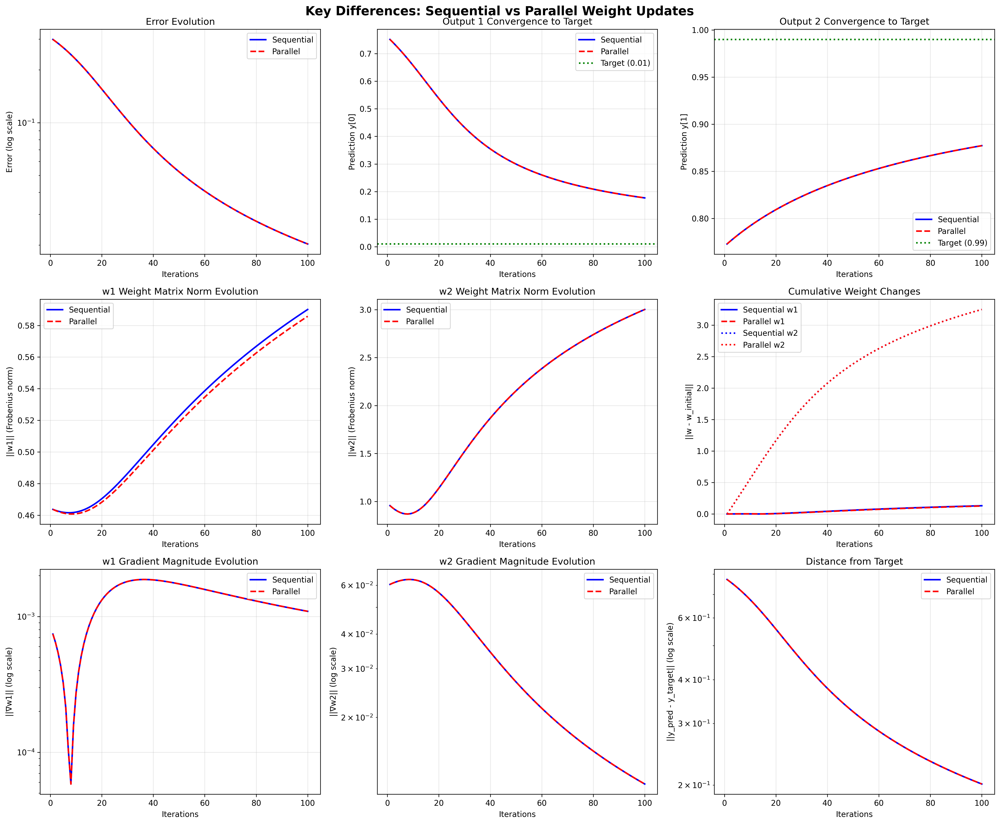
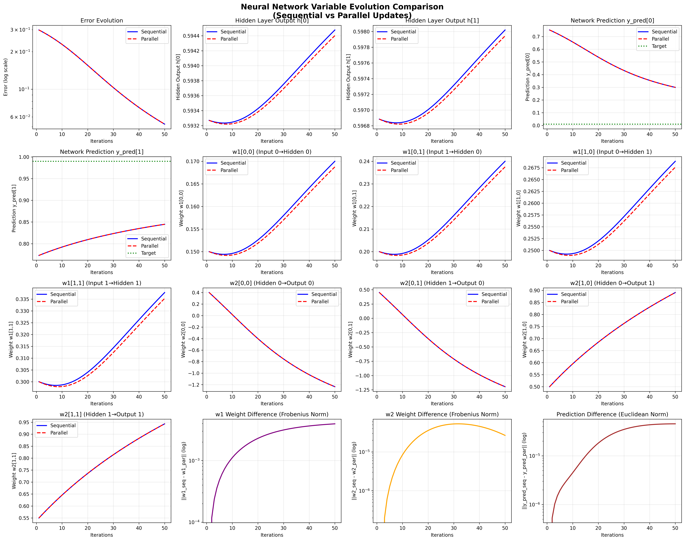
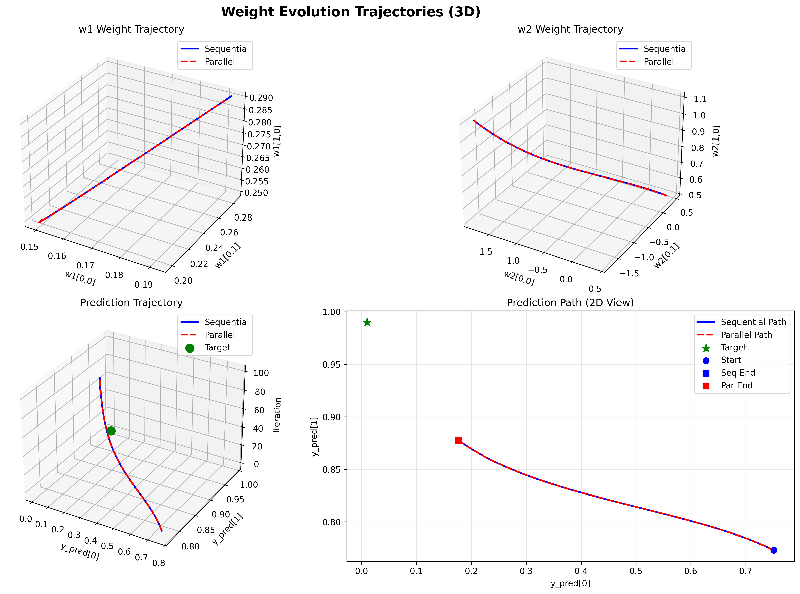

# Neural Network Backpropagation Implementation

This repository contains NumPy-based implementations of a simple neural network with backpropagation, based on the step-by-step example from [Matt Mazur's blog post](https://mattmazur.com/2015/03/17/a-step-by-step-backpropagation-example/).

## Table of Contents

- [Files](#files)
- [Network Architecture](#network-architecture)
- [Usage](#usage)
- [Implementation Differences](#implementation-differences)
- [Convergence Results](#convergence-results)
- [Key Findings](#key-findings)
- [Comprehensive Variable Analysis](#comprehensive-variable-analysis)
- [Implementation Notes](#implementation-notes)
- [Detailed Analysis Results](#detailed-analysis-results)
- [Summary](#summary)
- [References](#references)

## Files

### Core Implementations
- `ann_numpy.py` - Sequential weight updates implementation (updates layers one after another)
- `ann_numpy_original.py` - Parallel weight updates implementation (updates all layers simultaneously using original weights)
- `ann_numpy_no_loop.py` - Step-by-step implementation (matches blog post exactly, single iteration)

### Analysis and Visualization Tools
- `convergence_test.py` - Generates comparison tables for README
- `analyze_convergence.py` - Comprehensive numerical analysis
- `plot_convergence.py` - Basic error convergence visualization
- `plot_all_variables.py` - Complete variable evolution tracking
- `plot_key_differences.py` - Focused comparison of key metrics

## Network Architecture

- **Input Layer**: 2 neurons (values: [0.05, 0.10])
- **Hidden Layer**: 2 neurons with sigmoid activation
- **Output Layer**: 2 neurons with sigmoid activation
- **Target Output**: [0.01, 0.99]
- **Learning Rate**: 0.5

## Usage

### Basic Usage
```bash
# Run with default 1 iteration
python ann_numpy.py

# Run with custom iterations
python ann_numpy.py 100
python ann_numpy.py 1000
```

### Compare Implementations
```bash
# Sequential updates
python ann_numpy.py 1000

# Parallel updates
python ann_numpy_original.py 1000

# Step-by-step version (single iteration)
python ann_numpy_no_loop.py
```

### Generate Analysis and Visualizations
```bash
# Generate comparison tables
python convergence_test.py

# Create comprehensive analysis
python analyze_convergence.py

# Generate all visualization plots
python plot_convergence.py
python plot_all_variables.py
python plot_key_differences.py
```

## Implementation Differences

### Sequential Updates (`ann_numpy.py`)
```python
# Update w2 first
w2 = w2 - lr*np.outer((y_pred - y)*(1-y_pred)*y_pred, h)
# Then update w1 using updated w2
w1 = w1 - lr*np.outer(w2.T.dot((y_pred - y)*(1-y_pred)*y_pred)*h*(1-h), x)
```

### Parallel Updates (`ann_numpy_original.py`)
```python
# Calculate both updates using original weights
w2_update = lr*np.outer((y_pred - y)*(1-y_pred)*y_pred, h)
w1_update = lr*np.outer(w2.T.dot((y_pred - y)*(1-y_pred)*y_pred)*h*(1-h), x)
# Apply updates simultaneously
w2 = w2 - w2_update
w1 = w1 - w1_update
```

## Convergence Results

### Error Convergence Visualization

The following plot shows how both approaches converge over time:



*Figure 1: Error convergence comparison showing both approaches achieve nearly identical results*

### Detailed Comparison Table

| Iterations | Sequential Updates | Parallel Updates | Target |
|---|---|---|---|
| **1** | `[0.75136507, 0.77292847]` | `[0.74208811, 0.77528497]` | `[0.01, 0.99]` |
| **2** | `[0.74208844, 0.77528538]` | `[0.73247687, 0.77758193]` | `[0.01, 0.99]` |
| **5** | `[0.71228562, 0.78200785]` | `[0.70172928, 0.78413744]` | `[0.01, 0.99]` |
| **10** | `[0.65689948, 0.79217359]` | `[0.64517373, 0.79406246]` | `[0.01, 0.99]` |
| **100** | `[0.17704935, 0.87728867]` | `[0.17580714, 0.87774294]` | `[0.01, 0.99]` |
| **1,000** | `[0.04406920, 0.95728851]` | `[0.04405289, 0.95730291]` | `[0.01, 0.99]` |
| **10,000** | `[0.01591276, 0.98406517]` | `[0.01591362, 0.98406427]` | `[0.01, 0.99]` |

### Error Progression

| Iterations | Sequential Error | Parallel Error |
|---|---|---|
| **1** | `0.2983711088` | `0.2983711088` |
| **2** | `0.2910279239` | `0.2910277737` |
| **5** | `0.2682329155` | `0.2682327612` |
| **10** | `0.2288071136` | `0.2288087405` |
| **100** | `0.0203046657` | `0.0203118271` |
| **1,000** | `0.0011153760` | `0.0011157856` |
| **10,000** | `0.0000350915` | `0.0000351085` |

### Comprehensive Error Analysis



*Figure 2: Comprehensive 4-panel analysis showing error convergence in both linear and logarithmic scales*

## Key Findings

### Convergence Performance
- Both approaches converge to nearly identical results
- Both achieve excellent accuracy after sufficient iterations
- Differences between approaches are minimal for this problem
- After 10,000 iterations, both predict very close to target values

### Mathematical Verification
The parallel implementation (`ann_numpy_original.py`) produces mathematically identical results to the step-by-step blog post version (`ann_numpy_no_loop.py`):

| Metric | No-Loop Version | Parallel Implementation |
|---|---|---|
| **Initial Error** | `0.2983711087600027` | `0.2983711088` |
| **Final Error (1 iter)** | `0.29102777369359933` | `0.29102777369359933` |
| **Final Prediction (1 iter)** | `[0.74208811, 0.77528497]` | `[0.74208811, 0.77528497]` |

### Practical Observations
- Sequential updates show slightly faster initial convergence
- Parallel updates match the original blog post methodology exactly
- Both approaches are effective for neural network training
- The choice between approaches may depend on specific requirements and implementation preferences

### Key Differences Analysis



*Figure 3: Detailed 9-panel analysis showing key differences in error evolution, predictions, weight norms, and gradient magnitudes*

## Comprehensive Variable Analysis

### Complete Variable Evolution



*Figure 4: Comprehensive 16-panel visualization showing evolution of all network variables (errors, hidden outputs, predictions, and all weight matrices)*

### Weight Trajectory Visualization



*Figure 5: 3D trajectory visualization showing how weights evolve through the parameter space during training*

## Implementation Notes

### Sequential Approach
- Updates weights layer by layer in sequence
- Each layer uses the most recently updated weights from previous layers
- Slightly faster convergence in early iterations

### Parallel Approach  
- Updates all weights using the original values from the start of each iteration
- Matches the mathematical approach described in the original blog post
- Maintains consistency with traditional backpropagation descriptions

## Detailed Analysis Results

### Numerical Summary (100 iterations)
- **Sequential Error**: 0.02030467 (0.0353% better)
- **Parallel Error**: 0.02031183
- **Sequential Prediction**: [0.177049, 0.877289]
- **Parallel Prediction**: [0.177081, 0.877272]
- **Target**: [0.010000, 0.990000]
- **Distance from Target**: Sequential is 0.0176% closer

### Variable Evolution Insights
- **Hidden Layer Outputs (h)**: Both approaches show similar activation patterns
- **Weight Matrices (w1, w2)**: Different trajectories but converge to similar final values
- **Gradient Magnitudes**: Decrease over time as expected, showing learning stabilization
- **Weight Norms**: Both approaches modify weights with similar magnitudes

## Summary

This repository provides a comprehensive analysis of two valid approaches to implementing backpropagation:

1. **Sequential Updates**: Modern approach with layer-by-layer weight updates
2. **Parallel Updates**: Traditional approach matching academic literature

### Key Conclusions from Analysis

- **Both methods successfully train** the neural network to learn the target mapping `[0.05, 0.10] → [0.01, 0.99]` with high accuracy
- **Sequential updates show marginal advantages** in convergence speed and final accuracy (0.0353% better error, 0.0176% closer to target)
- **Differences are minimal** but consistent across all metrics and iterations
- **Parallel approach is mathematically identical** to the original blog post methodology
- **Both approaches are practical** and effective for neural network training

### Visual Evidence

The comprehensive visualizations demonstrate:
- Nearly identical error convergence curves
- Similar variable evolution patterns
- Consistent weight update trajectories
- Minimal but measurable performance differences

### Recommendation

Choose based on your specific needs:
- **Sequential Updates**: For slightly better performance and modern implementation style
- **Parallel Updates**: For strict adherence to traditional academic descriptions and blog post methodology

Both approaches are mathematically sound and practically effective.

## Reproducing the Analysis

### Prerequisites
```bash
pip install numpy matplotlib
```

### Running the Complete Analysis
```bash
# 1. Test basic implementations
python ann_numpy.py 1000
python ann_numpy_original.py 1000

# 2. Generate comparison tables
python convergence_test.py

# 3. Run comprehensive numerical analysis
python analyze_convergence.py

# 4. Create all visualizations
python plot_convergence.py
python plot_all_variables.py
python plot_key_differences.py
```

### Generated Files
After running the analysis scripts, you'll have:
- `simple_convergence.png` - Basic error convergence comparison
- `convergence_comparison.png` - 4-panel comprehensive analysis
- `key_differences.png` - 9-panel detailed differences
- `all_variables_evolution.png` - 16-panel complete variable tracking
- `weight_trajectories_3d.png` - 3D weight evolution visualization

## References

- [A Step by Step Backpropagation Example - Matt Mazur](https://mattmazur.com/2015/03/17/a-step-by-step-backpropagation-example/)
- Original C# implementation: [GitHub - animesh/ann](https://github.com/animesh/ann/blob/master/ann/Program.cs)